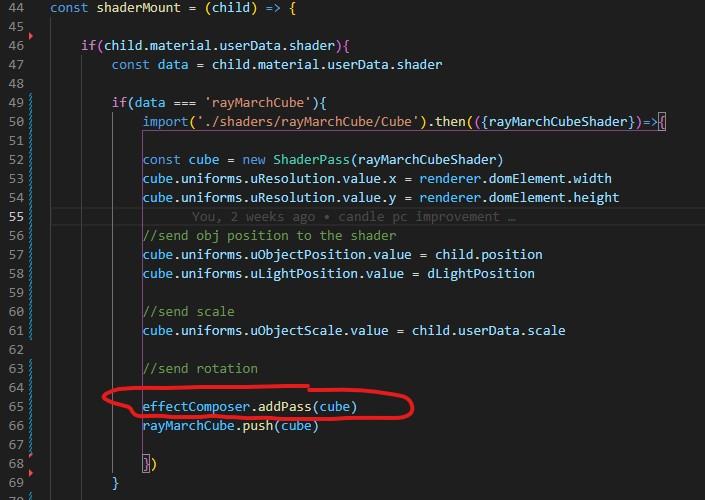

# The RayMarching synchro scene Source files

# catch the project:
git clone https://github.com/jeanclaude25/raymarching_synchro

# install all dependencies
npm i

# start the local server
npm run dev

# make a build
npm run build

I have this 3d file.
Its a blend file.
There is only 3 lines and a cube.
You will find it in the project's folder

On the material of my cube, there is this parameter "rayMarchCube".
It will be useful later on...

Then I load my 3d file in the classical way in three.js (./src/load_gl.js)

it works well... fine !!

Now I have a shaderPass that I add if we see in a material "rayMarchCube".
The goal is to recreate another cube or later other topologies, at the same place as the initial object

The function calls the shader and adds the pass without any problem.
I have a cube in raymarch...

But as you can see, the cube is not in the right place, and you don't see it on the picture, but the camera movement is not correct.

So the work will be situated in the shader fragment of this pass.

By receiving the position of the object, the camera and the trackTo of the camera, the camera of the rayMarch must be at the same place.

It is also necessary that when we face a panLeft or right, it works.
And when we change the perspective.
(./src/shaders/rayMarchCube/fragment.glsl)

